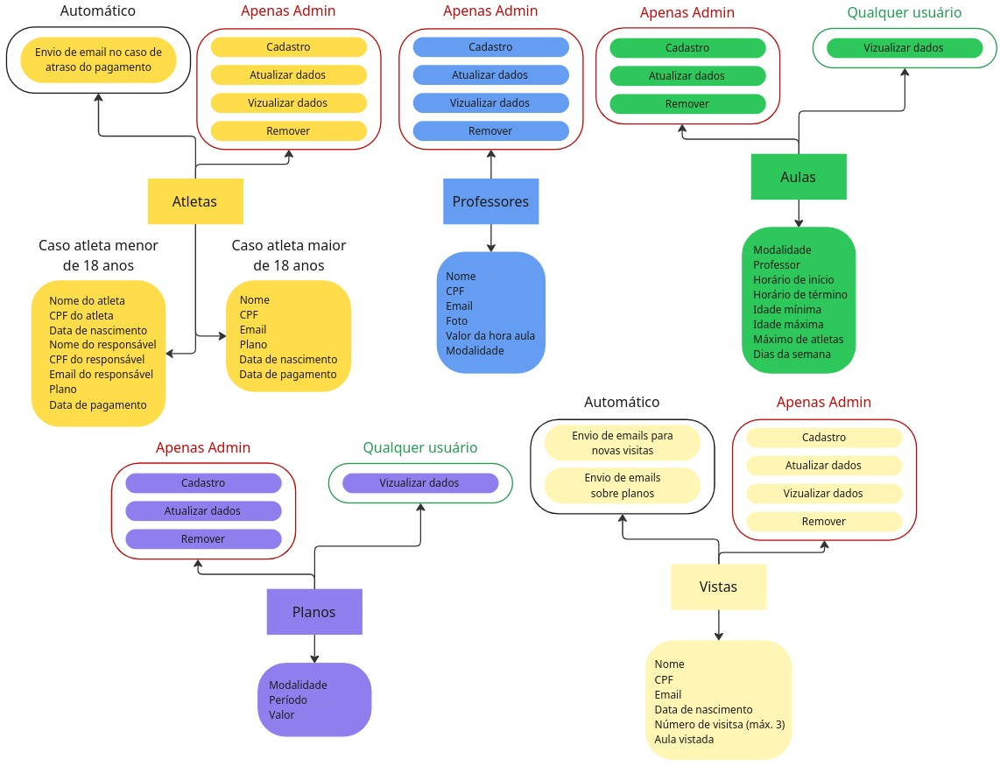

# Sobre

## Visão Geral
O Dojo System é um sistema para gerenciamento de academias de lutas, que permite às academias se organizarem de forma simples e eficiente. Além disso, oferece um portal onde alunos matriculados e interessados podem acessar informações sobre planos, modalidades, professores e outros serviços. Dessa forma, a plataforma contribui para que a academia se torne mais organizada, atraia novos alunos e estimule os atuais a conhecerem e aderirem a outras modalidades.

O sistema tem dois perfis de acesso:

- **Administradores / Funcionários**:  
Tem acesso a gestão de alunos, professores, planos, modalidades e horários. Com isso, poderam fácil acesso as principais informações da academia e organizar da melhor forma seus horarios e modalidades disponíveis.

- **Alunos**:  
Tem acesso as modalidades, professores, planos e horários disponíveis, facilitando a escolha do plane desejado e inscrever-ser para a(s) aula(s) de sua preferência

Diagrama da Visão Geral

## [Partes Interessadas](../about/stakeholders/)
Esta seção descreve as principais partes interessadas no projeto, incluindo administradores, recepcionistas, professores e alunos, detalhando seus papéis, responsabilidades e o nível de envolvimento com o sistema.

## [Requisitos](../about/requirements/)
Essa seção apresenta os requisitos do sistema, divididos entre o que é necessário para atletas e visitantes utilizarem a aplicação e as necessidades específicas destinadas aos administradores no gerenciamento completo do projeto.

## [Guia de Execução do projeto](../about/execution-guide/)
Essa seção fornece um passo a passo para executar o projeto localmente utilizando Docker. Nele você encontrará os pré-requisitos necessários, os comandos para configurar as variáveis de ambiente e as instruções para iniciar a aplicação de forma rápida e segura.